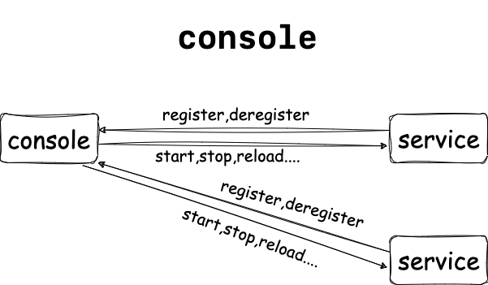

## **CMIRCO**
### Any Function Loader
`can load any function in golang;`use example
```go
import (
	"fmt"
	"plugin"
	"github.com/oswaldoooo/cmicro/api/common"
)

func main() {
	pl, err := plugin.Open("plugin/one.so")//open plugin file
	if err == nil {
		var (
			onetemp func(string) string //template func
			twotemp func(string) int 
			testone common.PluginOption = common.PluginOption{Name: "Testone", Target: onetemp}// tell plugin loader function is args
			testtwo common.PluginOption = common.PluginOption{Name: "Testtwo", Target: twotemp}
		)
		lang := common.LoadPlugin(pl, &testone, &testtwo)//get function instance
		if lang > 0 {
			onetemp = testone.Target.(func(string) string)
			twotemp = testtwo.Target.(func(string) int)
			fmt.Println(onetemp("jim"), twotemp("hello"))//do function
		}
	}

}
```
### Advanced IO 
`implement io.ReadWriteCloser`
```go
import (
	"fmt"
	"os"
	"github.com/oswaldoooo/cmicro/api/aio"
)

func main() {
	ai, err := aio.OpenFile("test.txt", os.O_RDWR|os.O_EXCL, 0644)
	if err != nil {
		fmt.Fprintln(os.Stderr, "[error]", err.Error())
		return
	}
	buffer := make([]byte, 1<<10)
	var lang int
	lang, err = ai.Read(buffer)
	if err == nil {
		fmt.Println(string(buffer[:lang]))
		_, err = ai.Write([]byte("\ni change it"))
		if err != nil {
			fmt.Fprintln(os.Stderr, "[wirte error]", err.Error())
		}
	} else {
		fmt.Fprintln(os.Stderr, "[error]", err.Error())
	}
	// time.Sleep(30 * time.Second)
	err = ai.Close()
	if err != nil {
		fmt.Fprintln(os.Stderr, "[close error]", err.Error())
	}
}
```
### Semaphore
**system v**
```go
import (
	"fmt"
	"os"
	"os/signal"
	"time"

	"github.com/oswaldoooo/cmicro/sys"
)

func main() {
	sem, err := sys.CreateSem(sys.SYSTEMV)
	if err == nil {
		ch := make(chan os.Signal)
		signal.Notify(ch, os.Interrupt)
		go func() {
			<-ch
			sem.Close()
			os.Exit(0)
		}()
		go func() {
			for i := 0; i < 10; i++ {
				time.Sleep(time.Second)
				sem.Post()//send signal
			}
		}()
		for {
			sem.Wait()//wait semaphore
			fmt.Println("accept semaphore")
		}
	} else {
		fmt.Fprintln(os.Stderr, "[error]", err.Error())
	}
}
```
### Share Memory
**posix**
```go
import (
	"github.com/oswaldoooo/cmicro/sys"
	"fmt"
)
func main(){
	var te *int32
	ptr:=sys.Shm_Open("test.shm",4,&te)
	if ptr!=nil{
		fmt.Println("data",*te)
		*te+=1//change share memory content
		sys.Shm_Close(ptr,4)
	}else{
		fmt.Println("[error] open test.shm failed")
	}
	
}
```
**system v**
```go
import (
	"github.com/oswaldoooo/cmicro/sys"
	"fmt"
)
func main(){
	var te *int32
	shmid:=3
	ptr:=sys.GetShare_Mem(3,&te)
	if ptr!=nil{
		fmt.Println("data",*te)
		*te+=1//change share memory content
		sys.Close_Share_Mem(ptr)
	}else{
		fmt.Println("[error] open share memory failed which shmid is 3")
	}
}
```
### cipher library
**example**
```go
import(
    "github.com/oswaldoooo/cmicro/kits/encrypt"
    _ "github.com/oswaldoooo/cmicro/pkg/encrypt"
)
func main(){
    cipher, err := encrypt.GetCryptor("dy_cipher", 200)
	if err == nil {
		ans, _ := cipher.Encrpyt([]byte(testwds))
		fmt.Printf("[encrypt]\n%s\n", string(ans))
		ans, err = cipher.Decrpyt(ans)
		if err == nil {
			fmt.Println(string(ans))
		}
	}
	if err != nil {
		fmt.Println(err.Error())
	}
}
```
### **Share Mutex**
Use Example
```go
import(
	"fmt"
	"github.com/oswaldoooo/api/mutex"
)
func main(){
	err := api.DialMutexCloudBackGround("127.0.0.1", 9000)//your mutex server host and port
	if err==nil{
		var mutex_id int32=3
		var ok bool
		ok,err=mutex.TryLock(mutex_id)
		if err==nil{
			if ok{
				fmt.Println("lock success")
				err=mutex.Unlock(mutex_id)
			}else{
				fmt.Println("lock failed")
			}
		}
	}
	if err!=nil{
		fmt.Println("[error]",err.Error())
	}
}
```

### **console_api**
```go
// example
cl, err := console_api.NewClient("origin", "localhost", 9000)
if err != nil {
    fmt.Println("connect to console failed")
    os.Exit(1)
}
err = client.RegisterService("serviceName", "serviceId", console_api.RELOAD, &console_api.Address{Add: "localhost", Port: 8000, TypeName: "tcp"})
if err != nil && err != io.EOF {
    fmt.Println(err.Error())
    os.Exit(1)
}


//deregister service from console
client.DeregisterService("serviceId")
```
### **enhance socket**
**server example**
```go
/* 
you need implement kits.Conn,and a function for register your kits.Conn
*/
import (
    "github.com/oswaldoooo/cmirco/kits"
    "json"
    "net"
)
type request struct {
	FirstName string `json:"first_name"`
	LastName  string `json:"last_name"`
}
type response struct {
	Ans string `json:"ans"`
	Err string `json:"error"`
}
type mirco_con struct {
	Request request
	Resp    response
	close   bool
	net.Conn
}

func register_conn(con net.Conn) kits.Conn {//register your kits.Conn
	return &mirco_con{Conn: con}
}


func (s *mirco_con) Decode(data []byte) error {//decode from bytes to your struct and then store it in connection
	return json.Unmarshal(data, &s.Request)
}

func (s *mirco_con) Do() error {//main method after decode,and you should return client response if you want
	var err error
	if len(s.Request.FirstName) == 0 || len(s.Request.LastName) == 0 {
		s.Resp.Err = "name is not completed"
		err = s.Bad_Response()
	} else {
		s.Resp.Ans = "hello " + s.Request.FirstName + "." + s.Request.LastName
		err = s.Response()
	}
	// flush the tcon data
	s.Request = request{}
	s.Resp = response{}
	return err
}

func (s *mirco_con) IsClose() bool {//is close connection
	return s.close
}

func (s *mirco_con) Response() error {//return noraml response
	content, err := json.Marshal(&s.Resp)
	if err == nil {
		_, err = s.Write(content)
	}
	return err
}

func (s *mirco_con) Bad_Response() error {//return a exception response
	content, err := json.Marshal(&s.Resp)
	if err == nil {
		_, err = s.Write(content)
	}
	return err
}

func main() {
	errchan := make(chan error)
	go kits.ListenAndServe("tcp", "localhost:8000", register_conn, errchan)
	for {
		select {
		case err := <-errchan:
			common.OuptutWithPrefix(&common.Prefix{Prefix: "error", Time: true}, err.Error())
		}
	}
}

```
**client example**
```go
import (
    "github.com/oswaldoooo/cmirco/kits"
    "net"
    "json"
)
type show_client struct {
	net.Conn
	Close bool
}

func (s *show_client) Register(con net.Conn) {//register your dial
	s.Conn = con
}

func (s *show_client) IsClose() bool {//is close the connection
	return s.Close
}

func (s *show_client) NeedWaitReturn() bool {//need wait server's response
	return true
}

var repchan = make(chan *response)

func (s *show_client) GetBack() error {//get server's response
	buffer := make([]byte, 5<<10)
	lang, err := s.Read(buffer)
	if err == nil {
		var rep response
		err = json.Unmarshal(buffer[:lang], &rep)
		if err == nil {
			repchan <- &rep
		}
	}
	return err
}

func main() {
	msgpip := make(chan any)
	errchan := make(chan error)
	cli := show_client{}
	go kits.Dial("tcp", "localhost:8000", &cli, msgpip, errchan)
	var req request
	reader := bufio.NewReader(os.Stdin)
	var msarr []string
	go func() {
		var err error
		err = common.SetRelease("error.log", true, 0600)
		if err != nil {
			fmt.Println(err.Error())
			os.Exit(1)
		}
		for {
			err = <-errchan
			common.OuptutWithPrefix(&common.Default_Err_Prefix, err.Error())
		}
	}()
	for {
		msg, _ := reader.ReadString('\n')
		msg = strings.TrimSpace(msg)
		msarr = strings.Split(msg, " ")
		req.FirstName = msarr[0]
		req.LastName = msarr[1]
		msgpip <- &req
		fmt.Println(<-repchan)
	}
}
```
### **common output**
```go
import "github.com/oswaldoooo/cmirco/api/common"
var erroroutput=common.Prefix{Prefix:"error",Time:true}
var warnoutput=common.Prefix{Prefix:"warning",Time:true}
func main(){
    // common.SetDebug()//direct output to terminal
    // common.SetRelease("running.log",false,0600)//output to running.log
    common.Output("without any prefix")
    common.OutputWithPrefix(&erroroutput,"error there")
    common.OutputWithPrefix(&warnoutput,"warn there")
}
```